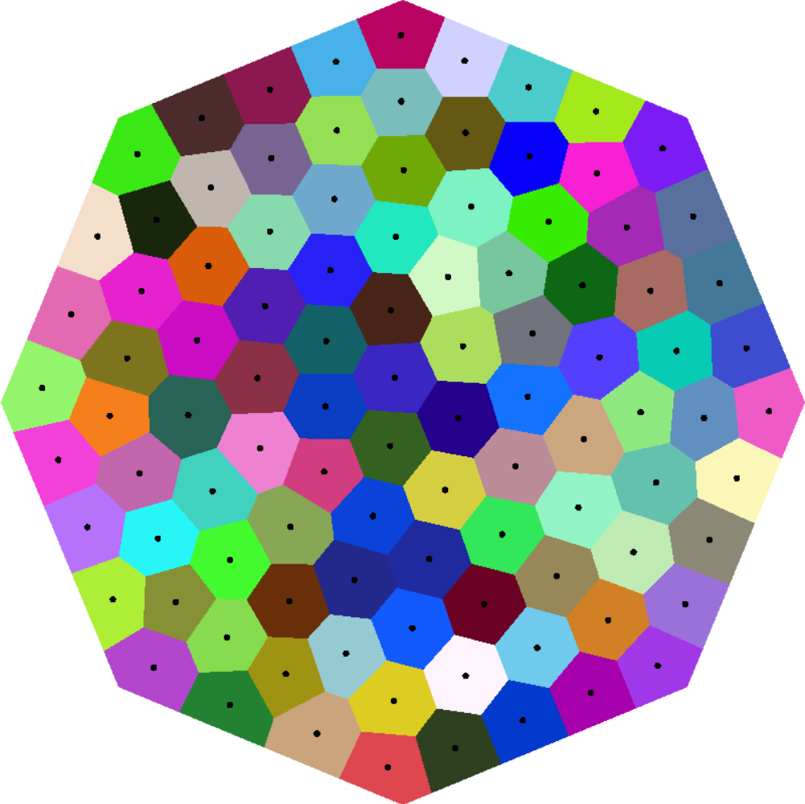
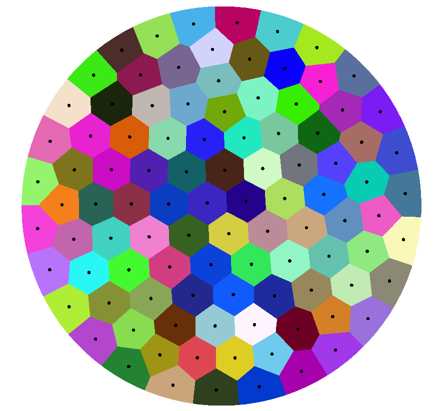
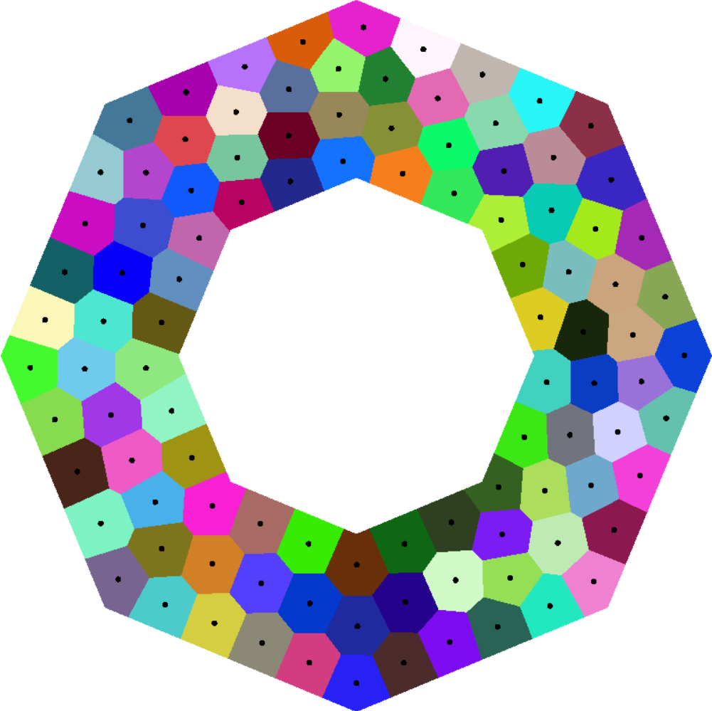
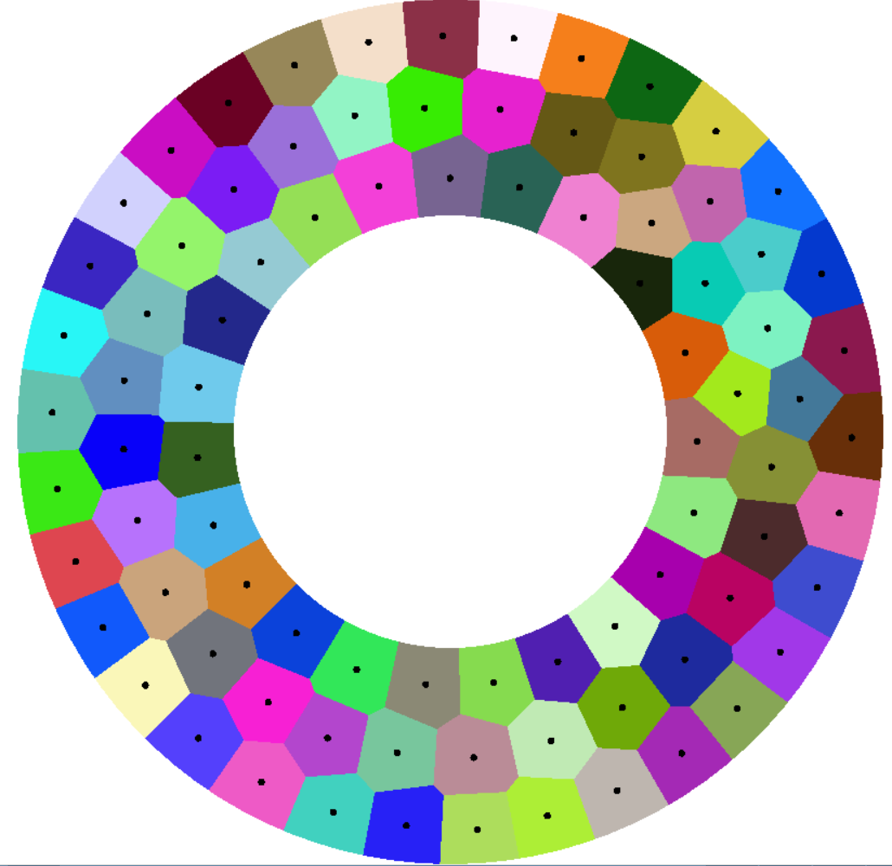
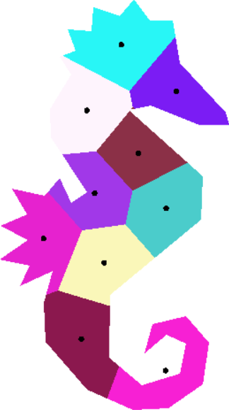
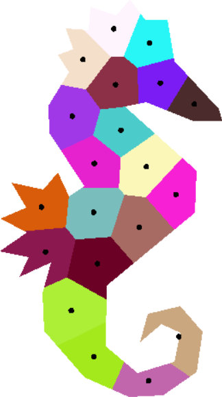
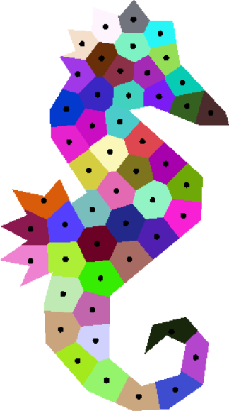
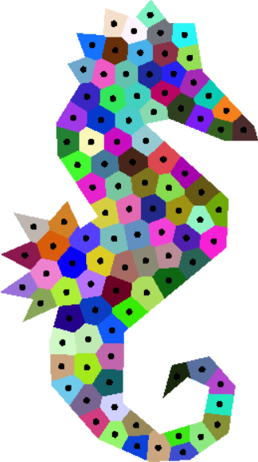

# CVT2D
A Lloyd algorithm implementation constructing Centroidal Voronoi Diagram in 2D. It uses the Voronoi\_diagram\_2 and Nef\_Polyhedron\_2 package in CGAL and works on arbitrary boundary contraints (i.e. whether it is convex or concave, connected or multi-connected, genus-0 or multi-genuses).

This is a new branch that use Matlab to deal with non-constant density function.
## Example

 
<caption align="bottom">Figure 1. Results.</caption>

 
<caption align="bottom">Figure 2. Results on a shrimp-shaped constraint with 10, 20, 50 and 100 generators.</caption>

## Parallel
Since the Nef\_polyhedron\_2 class in CGAL is currently not thread-safe, it is hard to use OpenMP directly to parallelly compute CVT. Here MPI is used to parallelly process the updating of centroids.

The performance on the disk boundary (approximated by 100 segments) with 1,000 generators and 100 iterations varing along with the number of processes is shown in the following:

| # of process   | time (sec.)   |
| -------------  | ------------- |
| 1              | 3843.4        |
| 2              | 2128.7        |
| 4              | 1120.6        |
| 8              | 595.3         |
| 16             | 314.4         |
| 32             | 180.1         |
| 64             | 169.3         |
